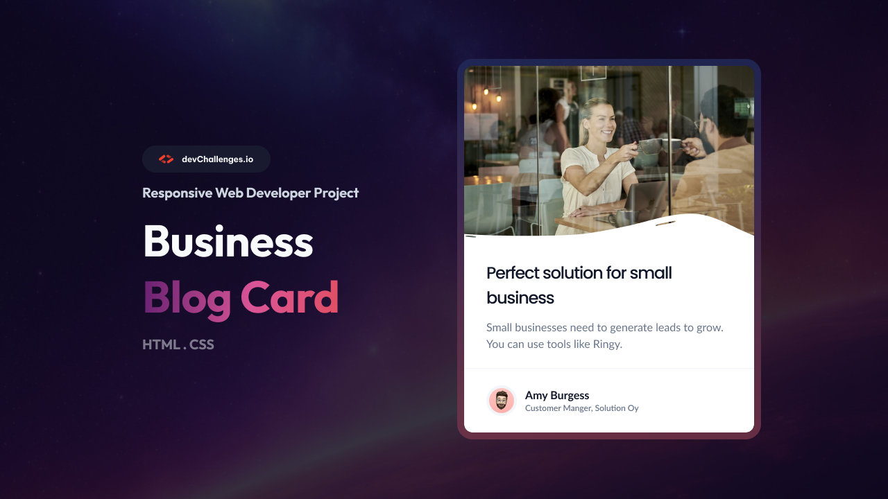

<!-- Please update value in the {}  -->

<h1 align="center">Business Blog Card | devChallenges</h1>

<div align="center">
   Solution for a challenge <a href="https://devchallenges.io/challenge/business-blog-card" target="_blank">Business Blog Card</a> from <a href="http://devchallenges.io" target="_blank">devChallenges.io</a>.
</div>

<div align="center">
  <h3>
    <a href="{https://your-demo-link.your-domain}">
      Demo
    </a>
    <span> | </span>
    <a href="https://devchallenges.io/challenge/business-blog-card">
      Challenge
    </a>
  </h3>
</div>

<!-- TABLE OF CONTENTS -->

## Table of Contents

- [Overview](#overview)
  - [What I learned](#what-i-learned)
  - [Useful resources](#useful-resources)
- [Built with](#built-with)
- [Features](#features)
- [Contact](#contact)

<!-- OVERVIEW -->

## Overview
Made with HTML & CSS. Utilized Flexbox, media queries, and relative units for responsive design.



### What I learned
I learned how to use the &lt;picture&gt; tag. I figured out that if you apply CSS styling to the main image, it will apply to all srcsets regardless of vw. 

My other challenge was figuring out how to make the width of the author section border match the width of the container. I used this as a workaround.

```ruby
  .author {
    width: calc(100% + 64px);
    margin-left: -32px;
   padding-left: 32px;
  }
```

### Useful resources
- <a href="https://www.w3schools.com/tags/tag_picture.asp" target="_blank">W3Schools &lt;Picture&gt; Tag</a> - Helpful overview of the picture tag.
- <a href="freecodecamp.org" target="_blank">Free Code Camp</a>

### Built with

- Semantic HTML5 markup
- CSS custom properties
- Flexbox

## Features

<!-- List the features of your application or follow the template. Don't share the figma file here :) -->

This application/site was created as a submission to a [DevChallenges](https://devchallenges.io/challenges-dashboard) challenge.

## Author

- GitHub [@mlvoorhis]( https://github.com/mlvoorhis)
